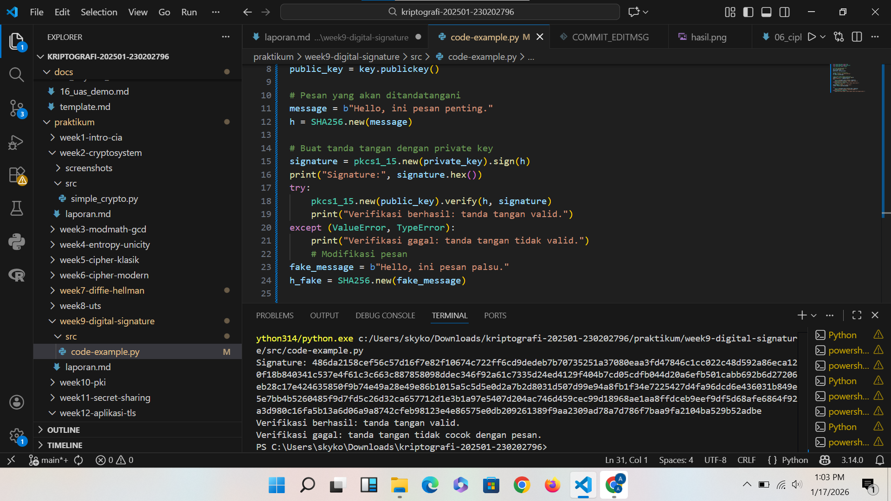

# Laporan Praktikum Kriptografi
Minggu ke-: 10  
Topik: Public Key Infrastructure (PKI & Certificate Authority)  
Nama: Adelya Ayu Virnanda  
NIM: 230202796  
Kelas: 5IKRB  

---

## 1. Tujuan
1. Membuat sertifikat digital sederhana.  
2. Menjelaskan peran Certificate Authority (CA) dalam sistem PKI.  
3. Mengevaluasi fungsi PKI dalam komunikasi aman (contoh: HTTPS, TLS).

---

## 2. Dasar Teori
Public Key Infrastructure (PKI) merupakan sebuah sistem yang mengelola penggunaan kriptografi kunci publik untuk menjamin kerahasiaan, integritas, dan keaslian data dalam komunikasi jaringan. PKI memanfaatkan pasangan kunci publik dan kunci privat, di mana kunci publik digunakan untuk enkripsi atau verifikasi tanda tangan digital, sedangkan kunci privat digunakan untuk dekripsi atau pembuatan tanda tangan digital.

Certificate Authority (CA) adalah pihak tepercaya yang bertugas menerbitkan sertifikat digital. Sertifikat ini mengikat identitas suatu entitas (seperti website atau pengguna) dengan kunci publiknya melalui tanda tangan digital CA. Dengan adanya CA, pihak lain dapat memverifikasi bahwa kunci publik benar-benar milik entitas yang sah.

Dalam protokol keamanan seperti HTTPS dan TLS, PKI digunakan untuk mencegah serangan seperti Man-in-the-Middle (MITM). Browser akan memverifikasi sertifikat server menggunakan rantai kepercayaan CA. Jika sertifikat valid dan ditandatangani oleh CA yang dipercaya, maka komunikasi dapat dilakukan secara terenkripsi dan aman.

---

## 3. Alat dan Bahan
- Python 3.14.0  
- Visual Studio Code / editor lain  
- Git dan akun GitHub  
- Library tambahan (misalnya pycryptodome, jika diperlukan)  

---

## 4. Langkah Percobaan
(Tuliskan langkah yang dilakukan sesuai instruksi.  
Contoh format:
1. Membuat file `pki_cert.py` di folder `praktikum/week10-pki/src/`.
2. Menyalin kode program dari panduan praktikum.
3. Menjalankan program dengan perintah `python pki_cert.py`.)

---

## 5. Source Code
(Salin kode program utama yang dibuat atau dimodifikasi.  
Gunakan blok kode:

```python
from cryptography import x509
from cryptography.x509.oid import NameOID
from cryptography.hazmat.primitives import hashes, serialization
from cryptography.hazmat.primitives.asymmetric import rsa
from datetime import datetime, timedelta

# Generate key pair
key = rsa.generate_private_key(public_exponent=65537, key_size=2048)

# Buat subject & issuer (CA sederhana = self-signed)
subject = issuer = x509.Name([
    x509.NameAttribute(NameOID.COUNTRY_NAME, u"ID"),
    x509.NameAttribute(NameOID.ORGANIZATION_NAME, u"UPB Kriptografi"),
    x509.NameAttribute(NameOID.COMMON_NAME, u"example.com"),
])

# Buat sertifikat
cert = (
    x509.CertificateBuilder()
    .subject_name(subject)
    .issuer_name(issuer)
    .public_key(key.public_key())
    .serial_number(x509.random_serial_number())
    .not_valid_before(datetime.utcnow())
    .not_valid_after(datetime.utcnow() + timedelta(days=365))
    .sign(key, hashes.SHA256())
)

# Simpan sertifikat
with open("cert.pem", "wb") as f:
    f.write(cert.public_bytes(serialization.Encoding.PEM))

print("Sertifikat digital berhasil dibuat: cert.pem")
```
)

---

## 6. Hasil dan Pembahasan
(- Lampirkan screenshot hasil eksekusi program (taruh di folder `screenshots/`).  
- Berikan tabel atau ringkasan hasil uji jika diperlukan.  
- Jelaskan apakah hasil sesuai ekspektasi.  
- Bahas error (jika ada) dan solusinya. 

Hasil eksekusi program Caesar Cipher:


)

---

## 7. Jawaban Pertanyaan
(Jawab pertanyaan diskusi yang diberikan pada modul.  
- Pertanyaan 1: Apa fungsi utama Certificate Authority (CA)?
Certificate Authority (CA) berfungsi sebagai pihak tepercaya yang bertugas memverifikasi identitas suatu entitas dan menerbitkan sertifikat digital yang mengaitkan identitas tersebut dengan kunci publiknya, sehingga komunikasi dalam jaringan dapat berlangsung secara aman. CA juga menjamin keaslian dan kepercayaan dalam penggunaan sertifikat, serta melakukan pengelolaan seperti pembaruan dan pencabutan sertifikat apabila sudah tidak berlaku atau terindikasi disalahgunakan.

- Pertanyaan 2: Mengapa self-signed certificate tidak cukup untuk sistem produksi?
Self-signed certificate tidak cukup untuk sistem produksi karena sertifikat tersebut tidak diverifikasi oleh pihak tepercaya (Certificate Authority), sehingga tingkat kepercayaannya rendah dan mudah dipalsukan. Akibatnya, pengguna atau browser akan menampilkan peringatan keamanan karena identitas server tidak dapat dipastikan keasliannya, yang berisiko membuka peluang serangan seperti man-in-the-middle dan menurunkan kepercayaan terhadap sistem.

- Pertanyaan 3: Bagaimana PKI mencegah serangan MITM dalam komunikasi TLS/HTTPS?
PKI mencegah serangan Man-in-the-Middle (MITM) dalam komunikasi TLS/HTTPS dengan memastikan keaslian identitas server melalui sertifikat digital yang diterbitkan oleh Certificate Authority (CA) tepercaya. Saat klien terhubung ke server, sertifikat server diverifikasi keabsahannya oleh CA, sehingga klien dapat yakin bahwa kunci publik yang digunakan benar milik server yang sah. Dengan demikian, penyerang tidak dapat menyamar sebagai server karena tidak memiliki sertifikat valid yang ditandatangani CA, sehingga proses pertukaran kunci dan enkripsi data tetap aman dari penyadapan atau pemalsuan.


---

## 8. Kesimpulan
Public Key Infrastructure (PKI) merupakan sistem yang digunakan untuk mengelola kunci publik dan sertifikat digital guna menjamin keamanan komunikasi, sedangkan Certificate Authority (CA) berperan sebagai pihak tepercaya yang memverifikasi identitas dan menerbitkan sertifikat digital. Melalui PKI, kunci publik suatu entitas dapat dipercaya keasliannya karena telah divalidasi oleh CA, sehingga komunikasi seperti pada TLS/HTTPS dapat berlangsung secara aman, terenkripsi, dan terlindungi dari penyadapan maupun pemalsuan identitas.


---

## 9. Daftar Pustaka
(Cantumkan referensi yang digunakan.  
Contoh:  
- Katz, J., & Lindell, Y. *Introduction to Modern Cryptography*.  
- Stallings, W. *Cryptography and Network Security*.  )

---

## 10. Commit Log
(Tuliskan bukti commit Git yang relevan.  
Contoh:
```
commit abc12345
Author: Adelya Ayu Virnanda <adelyavirnanda@gmsil.com>
Date:   17/1/2026

    week2-cryptosystem: implementasi Caesar Cipher dan laporan )
```
