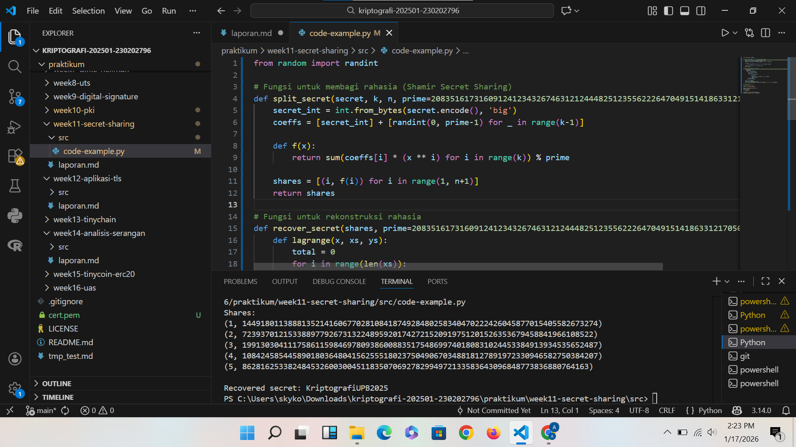

# Laporan Praktikum Kriptografi
Minggu ke-: 11
Topik: [Secret Sharing (Shamir’s Secret Sharing)]  
Nama: [Adelya Ayu Virnanda]  
NIM: [230202796]  
Kelas: [5IKRB]  

---

## 1. Tujuan
1. Menjelaskan konsep Shamir Secret Sharing (SSS).
2. Melakukan simulasi pembagian rahasia ke beberapa pihak menggunakan skema SSS.
3. Menganalisis keamanan skema distribusi rahasia.

---

## 2. Dasar Teori
1. Program Python simulasi pembagian rahasia dengan Shamir Secret Sharing.
2. Hasil rekonstruksi rahasia dari beberapa subset kunci.
3. Laporan singkat analisis keamanan secret sharing.

---

## 3. Alat dan Bahan
(- Python 3.x  
- Visual Studio Code / editor lain  
- Git dan akun GitHub  
- Library tambahan (misalnya pycryptodome, jika diperlukan)  )

---

## 4. Langkah Percobaan
(Tuliskan langkah yang dilakukan sesuai instruksi.  
Contoh format:
1. Membuat file `caesar_cipher.py` di folder `praktikum/week2-cryptosystem/src/`.
2. Menyalin kode program dari panduan praktikum.
3. Menjalankan program dengan perintah `python caesar_cipher.py`.)

---

## 5. Source Code
(Salin kode program utama yang dibuat atau dimodifikasi.  
Gunakan blok kode:

```python
from random import randint

# Fungsi untuk membagi rahasia (Shamir Secret Sharing)
def split_secret(secret, k, n, prime=208351617316091241234326746312124448251235562226470491514186331217050270460481):
    secret_int = int.from_bytes(secret.encode(), 'big')
    coeffs = [secret_int] + [randint(0, prime-1) for _ in range(k-1)]

    def f(x):
        return sum(coeffs[i] * (x ** i) for i in range(k)) % prime

    shares = [(i, f(i)) for i in range(1, n+1)]
    return shares

# Fungsi untuk rekonstruksi rahasia
def recover_secret(shares, prime=208351617316091241234326746312124448251235562226470491514186331217050270460481):
    def lagrange(x, xs, ys):
        total = 0
        for i in range(len(xs)):
            xi, yi = xs[i], ys[i]
            prod = yi
            for j in range(len(xs)):
                if i != j:
                    xj = xs[j]
                    prod *= (x - xj) * pow(xi - xj, -1, prime)
                    prod %= prime
            total += prod
        return total % prime

    xs, ys = zip(*shares)
    secret_int = lagrange(0, xs, ys)
    return secret_int.to_bytes((secret_int.bit_length() + 7) // 8, 'big').decode()

# =======================
# Program Utama
# =======================
secret = "KriptografiUPB2025"

shares = split_secret(secret, 3, 5)
print("Shares:")
for s in shares:
    print(s)

recovered = recover_secret(shares[:3])
print("\nRecovered secret:", recovered)
```
)

---

## 6. Hasil dan Pembahasan
(- Lampirkan screenshot hasil eksekusi program (taruh di folder `screenshots/`).  
- Berikan tabel atau ringkasan hasil uji jika diperlukan.  
- Jelaskan apakah hasil sesuai ekspektasi.  
- Bahas error (jika ada) dan solusinya. 

Hasil eksekusi program Caesar Cipher:


)

---

## 7. Jawaban Pertanyaan
(Jawab pertanyaan diskusi yang diberikan pada modul.  
- Pertanyaan 1: Apa keuntungan utama Shamir Secret Sharing dibanding membagikan salinan kunci secara langsung?
Keuntungan utama Shamir Secret Sharing dibandingkan membagikan salinan kunci secara langsung adalah meningkatnya tingkat keamanan, karena rahasia tidak disimpan atau didistribusikan dalam bentuk utuh, melainkan dipecah menjadi beberapa bagian (share) dengan ambang batas tertentu. Dengan mekanisme ini, satu atau dua pihak yang memegang share tidak dapat mengetahui kunci asli, dan rahasia hanya dapat direkonstruksi jika jumlah share minimal yang ditentukan terpenuhi, sehingga risiko kebocoran akibat kompromi satu pihak dapat diminimalkan.

- Pertanyaan 2: Apa peran threshold (k) dalam keamanan secret sharing?
Threshold (k) dalam secret sharing berperan sebagai batas minimal jumlah share yang harus digabungkan untuk dapat merekonstruksi rahasia, sehingga menentukan tingkat keamanan dan toleransi terhadap kegagalan. Dengan adanya threshold, rahasia tetap terlindungi meskipun sebagian share bocor atau hilang, karena tanpa mencapai jumlah k, informasi tentang kunci asli tidak dapat diperoleh, sehingga meningkatkan ketahanan sistem terhadap penyadapan maupun kompromi pihak tertentu.

- Pertanyaan 3: Berikan satu contoh skenario nyata di mana SSS sangat bermanfaat.
Salah satu contoh skenario nyata penggunaan Shamir Secret Sharing (SSS) adalah pada pengelolaan kunci utama sistem perbankan atau pusat data, di mana kunci enkripsi dibagi ke beberapa pejabat atau administrator. Dengan skema threshold, misalnya 3 dari 5 orang, kunci hanya dapat direkonstruksi jika minimal tiga pejabat hadir bersama, sehingga tidak ada satu orang pun yang memiliki akses penuh secara mandiri dan risiko penyalahgunaan atau kehilangan kunci dapat diminimalkan.

---

## 8. Kesimpulan
Shamir’s Secret Sharing merupakan metode kriptografi untuk membagi sebuah rahasia (misalnya kunci enkripsi) menjadi beberapa bagian (share) dengan menggunakan konsep ambang batas (threshold), di mana rahasia asli hanya dapat direkonstruksi jika sejumlah minimal share tertentu digabungkan. Teknik ini meningkatkan keamanan karena tidak ada satu pihak pun yang memegang rahasia secara utuh, sehingga risiko kebocoran atau penyalahgunaan dapat dikurangi dan kontrol akses terhadap rahasia menjadi lebih terdistribusi.


---

## 9. Daftar Pustaka
(Cantumkan referensi yang digunakan.  
Contoh:  
- Katz, J., & Lindell, Y. *Introduction to Modern Cryptography*.  
- Stallings, W. *Cryptography and Network Security*.  )

---

## 10. Commit Log
(Tuliskan bukti commit Git yang relevan.  
Contoh:
```
commit abc12345
Author: Adelya Ayu Virnanda <adelyavirnanda@gmail.com>
Date:   1/17/2026

    week2-cryptosystem: implementasi Caesar Cipher dan laporan )
```
