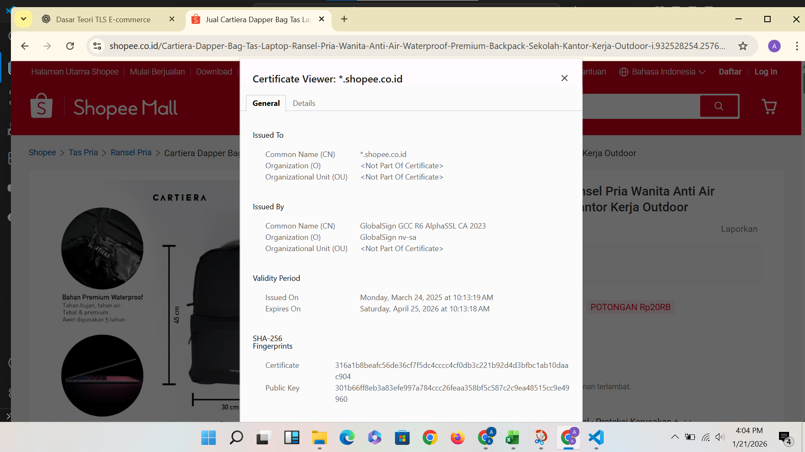

# Laporan Praktikum Kriptografi
Minggu ke-: 12
Topik: Aplikasi TLS & E-commerce  
Nama: Adelya Ayu Virnanda  
NIM: 230202796
Kelas: 5IKRB

---

## Tujuan Pembelajaran
Setelah mengikuti praktikum ini, mahasiswa diharapkan mampu:  
1. Menganalisis penggunaan kriptografi pada **email** dan **SSL/TLS**.  
2. Menjelaskan enkripsi dalam transaksi **e-commerce**.  
3. Mengevaluasi isu **etika & privasi** dalam penggunaan kriptografi di kehidupan sehari-hari
---

## 2. Dasar Teori
Transport Layer Security (TLS) adalah protokol keamanan yang digunakan untuk melindungi komunikasi data melalui jaringan internet dengan menjamin kerahasiaan, integritas, dan autentikasi data. TLS bekerja dengan mengenkripsi data yang dikirim antara klien dan server sehingga informasi tidak dapat dibaca atau dimanipulasi oleh pihak yang tidak berwenang. Dalam implementasinya, TLS menggunakan mekanisme handshake untuk pertukaran kunci dan sertifikat digital sebagai bukti keaslian server.

E-commerce merupakan aktivitas jual beli barang dan jasa yang dilakukan secara elektronik melalui internet. Sistem e-commerce melibatkan berbagai komponen seperti website atau aplikasi, sistem pembayaran, basis data, dan mekanisme keamanan. Karena transaksi e-commerce melibatkan data sensitif seperti informasi pribadi dan pembayaran, keamanan menjadi aspek yang sangat penting.

TLS memiliki peran penting dalam aplikasi e-commerce karena berfungsi mengamankan transaksi online melalui penggunaan protokol HTTPS. Dengan TLS, data pelanggan seperti informasi login dan pembayaran dapat terlindungi dari ancaman keamanan, sehingga meningkatkan kepercayaan pengguna dan mendukung kelancaran transaksi e-commerce secara aman dan terpercaya.


---

## 3. Alat dan Bahan
(- Python 3.x  
- Visual Studio Code / editor lain  
- Git dan akun GitHub  
- Library tambahan (misalnya pycryptodome, jika diperlukan)  )

---

## 4. Langkah Percobaan
(Tuliskan langkah yang dilakukan sesuai instruksi.  
Contoh format:
1. Membuat file `Aplikasi TLS & E-commerce.py` di folder `praktikum/week12-E-commerce/src/`
2. Menyalin kode program dari panduan praktikum.
3. Menjalankan program dengan perintah `python caesar_cipher.py`.)

---

## 5. Source Code
(Salin kode program utama yang dibuat atau dimodifikasi.  
Gunakan blok kode:

```python
# contoh potongan kode
def encrypt(text, key):
    return ...
```
)

---

## 6. Hasil dan Pembahasan
(- Lampirkan screenshot hasil eksekusi program (taruh di folder `screenshots/`).  
- Berikan tabel atau ringkasan hasil uji jika diperlukan.  
- Jelaskan apakah hasil sesuai ekspektasi.  
- Bahas error (jika ada) dan solusinya. 

Hasil eksekusi program Caesar Cipher:



---

## 7. Jawaban Pertanyaan 
 1. Apa perbedaan utama antara HTTP dan HTTPS? 
 Jawab : Perbedaan utama antara HTTP dan HTTPS terletak pada aspek keamanannya. HTTP mengirimkan data dalam bentuk teks biasa (plain text) sehingga mudah disadap atau dimanipulasi oleh pihak lain. Sementara itu, HTTPS menggunakan protokol TLS untuk mengenkripsi data yang dikirim antara klien dan server, sehingga komunikasi menjadi lebih aman, terlindungi, dan dapat memverifikasi identitas server.

2. Mengapa sertifikat digital menjadi penting dalam komunikasi TLS? 
Jawab : Sertifikat digital penting dalam komunikasi TLS karena berfungsi untuk memverifikasi identitas pihak yang berkomunikasi, khususnya server. Sertifikat digital yang dikeluarkan oleh Certificate Authority (CA) memastikan bahwa pengguna benar-benar terhubung ke server yang sah, bukan server palsu. Selain itu, sertifikat digital digunakan dalam proses pertukaran kunci enkripsi yang aman. 

3. Bagaimana kriptografi mendukung privasi dalam komunikasi digital, tetapi sekaligus menimbulkan tantangan hukum dan etika? 
Jawab : Sertifikat digital penting dalam komunikasi TLS karena berfungsi untuk memverifikasi identitas pihak yang berkomunikasi, khususnya server. Sertifikat digital yang dikeluarkan oleh Certificate Authority (CA) memastikan bahwa pengguna benar-benar terhubung ke server yang sah, bukan server palsu. Selain itu, sertifikat digital digunakan dalam proses pertukaran kunci enkripsi yang aman.
)
---

## 8. Kesimpulan
Kesimpulannya, penerapan HTTPS dengan dukungan TLS dan sertifikat digital sangat penting untuk menjaga keamanan komunikasi digital, khususnya dalam pertukaran data melalui internet. Kriptografi berperan besar dalam melindungi privasi dan mencegah penyalahgunaan data, namun di sisi lain juga menimbulkan tantangan hukum dan etika terkait akses informasi oleh pihak berwenang. Oleh karena itu, diperlukan keseimbangan antara perlindungan privasi pengguna dan kepentingan hukum serta keamanan agar pemanfaatan teknologi keamanan digital dapat berjalan secara bertanggung jawab dan efektif.

---

## 9. Daftar Pustaka
(Cantumkan referensi yang digunakan.  
Contoh:  
- Katz, J., & Lindell, Y. *Introduction to Modern Cryptography*.  
- Stallings, W. *Cryptography and Network Security*.  )

---

## 10. Commit Log
(Tuliskan bukti commit Git yang relevan.  
Contoh:
```
commit abc12345
Author: Nama Mahasiswa <email>
Date:   2025-09-20

    week2-cryptosystem: implementasi Caesar Cipher dan laporan )
```
