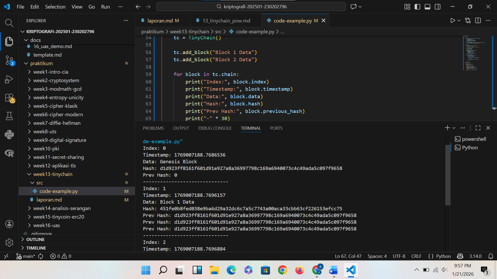

# Laporan Praktikum Kriptografi
Minggu ke-: 13
Topik: TinyChain – Proof of Work (PoW)
Nama: Adelya Ayu Virnanda  
NIM: 230202796 
Kelas: 5IKRB

---

## 1. Tujuan
1. Menjelaskan peran hash function dalam blockchain.
2. Melakukan simulasi sederhana Proof of Work (PoW).
3. Menganalisis keamanan cryptocurrency berbasis kriptografi.

---

## 2. Dasar Teori
Proof of Work (PoW) pada TinyChain merupakan mekanisme konsensus yang digunakan untuk memvalidasi dan menambahkan blok baru ke dalam blockchain dengan cara mencari nilai *nonce* yang menghasilkan *hash* sesuai tingkat kesulitan tertentu. Proses ini mensimulasikan aktivitas penambangan, di mana setiap perubahan data akan mengubah nilai *hash* secara signifikan, sehingga menjamin integritas dan keamanan blok. Dengan PoW, TinyChain menunjukkan bagaimana beban komputasi digunakan sebagai bukti keabsahan blok dan sebagai perlindungan terhadap pemalsuan data dalam sistem blockchain.

---

## 3. Alat dan Bahan
(- Python 3.x  
- Visual Studio Code / editor lain  
- Git dan akun GitHub  
- Library tambahan (misalnya pycryptodome, jika diperlukan)  )

---

## 4. Langkah Percobaan
(Tuliskan langkah yang dilakukan sesuai instruksi.  
Contoh format:
1. Membuat file `tinychain.py` di folder `praktikum/week13-cryptosystem/src/`.
2. Menyalin kode program dari panduan praktikum.
3. Menjalankan program dengan perintah `python caesar_cipher.py`.)

---

## 5. Source Code
(Salin kode program utama yang dibuat atau dimodifikasi.  
Gunakan blok kode:

```python
# contoh potongan kode
def encrypt(text, key):
    return ...
```
)

---

## 6. Hasil dan Pembahasan
- Lampirkan screenshot hasil eksekusi program (taruh di folder `screenshots/`).  
- Berikan tabel atau ringkasan hasil uji jika diperlukan.  
- Jelaskan apakah hasil sesuai ekspektasi.  
- Bahas error (jika ada) dan solusinya. 

Hasil eksekusi program Caesar Cipher:


---

## 7. Jawaban Pertanyaan
(Jawab pertanyaan diskusi yang diberikan pada modul.  
1. Mengapa fungsi hash sangat penting dalam blockchain? 
Jawab : Fungsi hash sangat penting dalam blockchain karena digunakan untuk menjaga integritas dan keamanan data. Setiap blok memiliki nilai hash unik yang bergantung pada seluruh isi blok dan hash blok sebelumnya, sehingga jika terjadi perubahan sedikit saja pada data, nilai hash akan berubah drastis dan langsung terdeteksi 
2. Bagaimana Proof of Work mencegah double spending?  
Jawab : Proof of Work mencegah double spending dengan mewajibkan setiap transaksi divalidasi dan dimasukkan ke dalam blok yang telah disetujui jaringan. Karena pembuatan blok memerlukan proses komputasi yang sulit dan memakan waktu, maka seseorang tidak dapat dengan mudah memalsukan atau menggandakan transaksi tanpa menguasai sebagian besar daya komputasi jaringan.
3. Apa kelemahan dari PoW dalam hal efisiensi energi?  
Jawab : Kelemahan utama PoW dalam hal efisiensi energi adalah kebutuhan daya komputasi yang sangat besar untuk melakukan proses penambangan. Perhitungan hash yang berulang-ulang mengonsumsi banyak listrik, sehingga sistem PoW dianggap boros energi dan kurang ramah lingkungan. 
)
---

## 8. Kesimpulan
Proof of Work (PoW) pada TinyChain berperan sebagai mekanisme untuk memastikan keabsahan dan keamanan blok melalui proses komputasi dalam pencarian nilai *hash* yang sesuai tingkat kesulitan. Mekanisme ini menjaga integritas data karena setiap perubahan pada blok akan mengharuskan perhitungan ulang, sehingga mencegah manipulasi dan menjamin keandalan sistem blockchain.


---

## 9. Daftar Pustaka
(Cantumkan referensi yang digunakan.  
Contoh:  
- Katz, J., & Lindell, Y. *Introduction to Modern Cryptography*.  
- Stallings, W. *Cryptography and Network Security*.  )

---

## 10. Commit Log

commit abc12345
Author: Adelya Ayu Virnanda <adelyavirnanda@gmail.com>
Date:   2025-01-21

    week13-TinyChain
```
