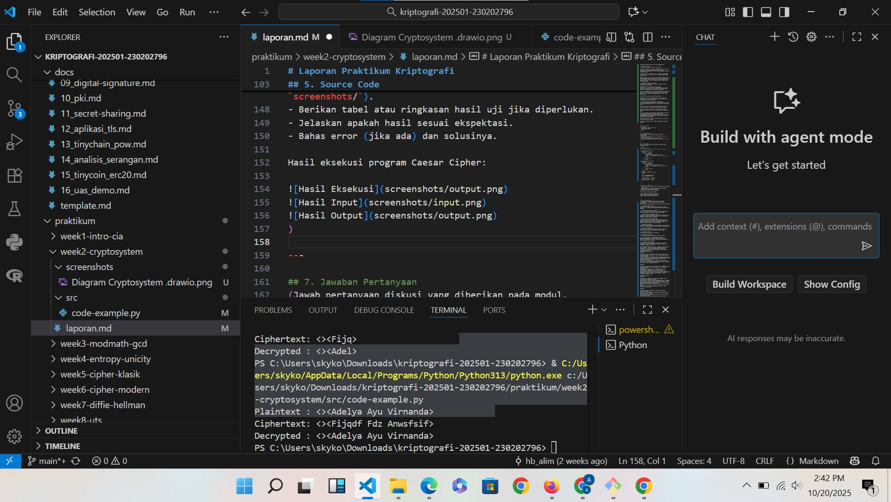

# Laporan Praktikum Kriptografi
Minggu ke-: 2
Topik: [02 Cryptosystem (Komponen, Enkripsi & Dekripsi, Simetris & Asimetris)]
Nama: [Adelya Ayu Virnanda]  
NIM: [230202796]  
Kelas: [5IKRB]  

---

## 1. Tujuan
Setelah mengikuti praktikum ini, mahasiswa diharapkan mampu:

Mengidentifikasi komponen dasar kriptosistem (plaintext, ciphertext, kunci, algoritma).
Menggambarkan proses enkripsi dan dekripsi sederhana.
Mengklasifikasikan jenis kriptosistem (simetris dan asimetris).

## 2. Dasar Teori  
Contoh: definisi cipher klasik, konsep modular aritmetika, dll.  
Jawab : kriptosistem adalah sebuah sistem lengkap yang digunakan untuk mengamankan data. Anggap saja ini seperti seperangkat alat untuk mengirim pesan rahasia. Agar sistem ini bisa berjalan, ada beberapa komponen penting yang harus ada:

Plaintext: Ini adalah pesan asli yang ingin kamu kirim, dalam bentuk yang bisa dibaca dan dimengerti oleh siapa saja. Contohnya, teks "SERANG FAJAR".

Ciphertext: Ini adalah pesan rahasia hasil dari proses pengacakan (enkripsi). Bentuknya sudah tidak bisa dibaca lagi secara langsung. Contohnya, plaintext "SERANG FAJAR" bisa menjadi "VHUDQJ IDMDU".

Kunci (Key): Ini adalah informasi rahasia (seperti kata sandi) yang digunakan untuk mengubah plaintext menjadi ciphertext dan sebaliknya. Kunci inilah yang menjadi penentu utama keamanan sebuah sistem.

Algoritma: Ini adalah rumus atau metode matematika yang digunakan untuk melakukan proses enkripsi dan dekripsi. Algoritma bekerja bersama kunci untuk mengubah data.

Enkripsi & Dekripsi
Ini adalah dua proses inti dalam kriptosistem.

Enkripsi (Encryption): Proses ini mengubah plaintext menjadi ciphertext. Tujuannya adalah untuk "mengunci" atau menyembunyikan informasi asli. Proses ini menggunakan algoritma dan sebuah kunci..

Dekripsi (Decryption): Proses ini adalah kebalikannya, yaitu mengubah kembali ciphertext menjadi plaintext. Tujuannya adalah untuk "membuka" pesan rahasia agar bisa dibaca kembali oleh penerima yang sah. Proses ini juga memerlukan algoritma dan kunci yang tepat.

Tentu, mari kita bahas satu per satu mengenai Kriptosistem, mulai dari komponennya hingga jenis-jenis utamanya.

> Komponen Kriptosistem
Secara sederhana, kriptosistem adalah sebuah sistem lengkap yang digunakan untuk mengamankan data. Anggap saja ini seperti seperangkat alat untuk mengirim pesan rahasia. Agar sistem ini bisa berjalan, ada beberapa komponen penting yang harus ada:

Plaintext: Ini adalah pesan asli yang ingin kamu kirim, dalam bentuk yang bisa dibaca dan dimengerti oleh siapa saja. Contohnya, teks "SERANG FAJAR".

Ciphertext: Ini adalah pesan rahasia hasil dari proses pengacakan (enkripsi). Bentuknya sudah tidak bisa dibaca lagi secara langsung. Contohnya, plaintext "SERANG FAJAR" bisa menjadi "VHUDQJ IDMDU".

Kunci (Key): Ini adalah informasi rahasia (seperti kata sandi) yang digunakan untuk mengubah plaintext menjadi ciphertext dan sebaliknya. Kunci inilah yang menjadi penentu utama keamanan sebuah sistem.

Algoritma: Ini adalah rumus atau metode matematika yang digunakan untuk melakukan proses enkripsi dan dekripsi. Algoritma bekerja bersama kunci untuk mengubah data.

> Enkripsi & Dekripsi
Ini adalah dua proses inti dalam kriptosistem.

Enkripsi (Encryption): Proses ini mengubah plaintext menjadi ciphertext. Tujuannya adalah untuk "mengunci" atau menyembunyikan informasi asli. Proses ini menggunakan algoritma dan sebuah kunci.

Contoh: Pesan asli (plaintext) "HALO" dienkripsi menggunakan algoritma geser huruf dan kunci "3", sehingga menjadi "KDOR" (ciphertext).

Dekripsi (Decryption): Proses ini adalah kebalikannya, yaitu mengubah kembali ciphertext menjadi plaintext. Tujuannya adalah untuk "membuka" pesan rahasia agar bisa dibaca kembali oleh penerima yang sah. Proses ini juga memerlukan algoritma dan kunci yang tepat.

 > Kriptografi Simetris & Asimetris
Berdasarkan cara penggunaan kuncinya, kriptografi dibagi menjadi dua jenis utama:

Kriptografi Simetris (Symmetric Cryptography)
Pada jenis ini, satu kunci yang sama digunakan untuk proses enkripsi dan dekripsi. Artinya, pengirim dan penerima harus memiliki dan menggunakan kunci rahasia yang identik.

Analogi: Bayangkan kamu dan temanmu menggunakan satu gembok dan satu anak kunci yang sama. Kamu mengunci kotak surat dengan gembok itu, dan temanmu membukanya dengan anak kunci yang persis sama.

Kelebihan: Prosesnya sangat cepat dan efisien.

Kekurangan: Sulit untuk membagikan kunci rahasia kepada penerima secara aman. Jika kunci ini bocor di tengah jalan, maka keamanan pesan menjadi rentan.

> Kriptografi Asimetris (Asymmetric Cryptography)
Jenis ini menggunakan sepasang kunci yang berbeda tapi saling berhubungan secara matematis: satu kunci publik dan satu kunci privat.

Kunci Publik (Public Key): Boleh disebar dan diketahui oleh siapa saja. Kunci ini digunakan untuk mengenkripsi pesan.

Kunci Privat (Private Key): Harus dirahasiakan dan hanya dimiliki oleh penerima. Kunci ini digunakan untuk mendekripsi pesan.

Analogi: Bayangkan kamu membagikan banyak gembok yang terbuka (kunci publik) kepada semua orang. Siapa pun bisa menggunakannya untuk mengunci pesan untukmu. Tapi, hanya kamu yang memegang satu-satunya anak kunci (kunci privat) untuk membuka semua gembok tersebut.

Kelebihan: Lebih aman dalam hal distribusi kunci. Kamu tidak perlu mengirim kunci rahasia.

Kekurangan: Prosesnya lebih lambat dibandingkan kriptografi simetris.

---

## 3. Alat dan Bahan
(- Python 3.x  
- Visual Studio Code / editor lain  
- Git dan akun GitHub  
- Terminal

---

## 4. Langkah Percobaan
(Tuliskan langkah yang dilakukan sesuai instruksi.  
Contoh format:
1. Membuat file `simple_crypto.py` di folder `praktikum/week2-cryptosystem/src/`.
2. Menyalin kode program dari panduan praktikum.
3. Menjalankan program dengan perintah `python simple_crypto.py`.)

---

## 5. Source Code
(Salin kode program utama yang dibuat atau dimodifikasi.  
Gunakan blok kode:

```python
# contoh potongan kode
#file: praktikum/week2-cryptosystem/src/simple_crypto.py

def encrypt(plaintext, key):
    result = ""
    for char in plaintext:
        if char.isalpha():
            shift = 65 if char.isupper() else 97
            result += chr((ord(char) - shift + key) % 26 + shift)
        else:
            result += char
    return result

def decrypt(ciphertext, key):
    result = ""
    for char in ciphertext:
        if char.isalpha():
            shift = 65 if char.isupper() else 97
            result += chr((ord(char) - shift - key) % 26 + shift)
        else:
            result += char
    return result

if __name__ == "__main__":
    message =" Adelya Ayu Virnanda"
    key = 5

    enc = encrypt(message, key)
    dec = decrypt(enc, key)

    print("Plaintext :", message)
    print("Ciphertext:", enc)
    print("Decrypted :", dec)
```
)

---

## 6. Hasil dan Pembahasan
- Lampirkan screenshot hasil eksekusi program (taruh di folder `screenshots/`).  
- Berikan tabel atau ringkasan hasil uji jika diperlukan.  
- Jelaskan apakah hasil sesuai ekspektasi.  
- Bahas error (jika ada) dan solusinya. 

Hasil eksekusi program Caesar Cipher:




---

## 7. Jawaban Pertanyaan
(Jawab pertanyaan diskusi yang diberikan pada modul.  
- Pertanyaan 1: Sebutkan komponen utama dalam sebuah kriptosistem.
Jawab : Berikut adalah komponen utama dalam sebuah kriptosistem:

 1. **Plaintext (Teks Asli)**
Pesan atau informasi asli yang ingin dilindungi, sebelum dienkripsi. Ini adalah data dalam bentuk yang dapat dibaca dan dipahami.

 2. **Ciphertext (Teks Terenkripsi)**
Hasil dari proses enkripsi plaintext. Bentuknya tidak dapat dibaca dan dipahami tanpa proses dekripsi yang tepat.

 3. **Kunci Enkripsi (Encryption Key)**
Informasi rahasia yang digunakan oleh algoritma enkripsi untuk mengubah plaintext menjadi ciphertext. Kunci ini menentukan bagaimana transformasi data dilakukan.

 4. **Kunci Dekripsi (Decryption Key)**
Informasi rahasia yang digunakan untuk mengubah ciphertext kembali menjadi plaintext. Dalam kriptografi simetris, kunci enkripsi dan dekripsi sama. Dalam kriptografi asimetris, keduanya berbeda (public key dan private key).

 5. **Algoritma Enkripsi**
Prosedur atau fungsi matematika yang mengubah plaintext menjadi ciphertext menggunakan kunci enkripsi. Contoh: AES, RSA, DES.

 6. **Algoritma Dekripsi**
Prosedur atau fungsi matematika yang mengubah ciphertext kembali menjadi plaintext menggunakan kunci dekripsi.

 7. **Pengirim (Sender)**
Pihak yang mengirimkan pesan terenkripsi.

 8. **Penerima (Receiver)**
Pihak yang menerima dan mendekripsi pesan terenkripsi.

 9. **Saluran Komunikasi (Communication Channel)**
Medium yang digunakan untuk mengirimkan ciphertext dari pengirim ke penerima. Saluran ini diasumsikan tidak aman dan dapat disadap oleh pihak ketiga.

 10. **Keyspace (Ruang Kunci)**
Himpunan semua kunci yang mungkin digunakan dalam sistem kriptografi tertentu. Semakin besar keyspace, semakin sulit melakukan serangan brute force.

Kelima komponen pertama (plaintext, ciphertext, kunci enkripsi, kunci dekripsi, dan algoritma enkripsi/dekripsi) adalah komponen inti yang harus ada dalam setiap kriptosistem.
- Pertanyaan 2: Apa kelebihan dan kelemahan sistem simetris dibandingkan asimetris? 
Jawab : Kriptografi Simetris
Kelebihan:

Kecepatan tinggi: Algoritma simetris jauh lebih cepat dalam melakukan enkripsi dan dekripsi, cocok untuk mengenkripsi data dalam jumlah besar
Efisiensi komputasi: Membutuhkan resource komputasi yang lebih rendah, sehingga cocok untuk perangkat dengan kemampuan terbatas
Kesederhanaan algoritma: Implementasinya relatif lebih sederhana secara matematis
Ukuran kunci lebih kecil: Untuk tingkat keamanan yang sama, kunci simetris lebih pendek dibanding kunci asimetris (misalnya 256-bit AES setara dengan 3072-bit RSA)

Kelemahan:

Masalah distribusi kunci: Kunci rahasia harus dibagikan secara aman kepada semua pihak yang berkomunikasi, yang menjadi tantangan utama
Manajemen kunci kompleks: Untuk n pengguna yang saling berkomunikasi, dibutuhkan n(n-1)/2 kunci berbeda
Tidak mendukung tanda tangan digital: Karena semua pihak menggunakan kunci yang sama, sulit membuktikan keaslian pengirim
Skalabilitas terbatas: Semakin banyak pengguna, semakin kompleks manajemen kuncinya

Kriptografi Asimetris
Kelebihan:

Distribusi kunci mudah: Public key dapat dibagikan secara terbuka tanpa mengorbankan keamanan
Manajemen kunci sederhana: Setiap pengguna hanya perlu 1 pasang kunci (public dan private) untuk berkomunikasi dengan siapapun
Mendukung tanda tangan digital: Dapat memverifikasi identitas pengirim dan memastikan integritas pesan
Non-repudiation: Pengirim tidak dapat menyangkal telah mengirim pesan
Skalabilitas baik: Mudah menambahkan pengguna baru tanpa kompleksitas eksponensial

Kelemahan:

Kecepatan lambat: 100-1000 kali lebih lambat dibanding kriptografi simetris
Resource intensif: Membutuhkan komputasi yang lebih berat dan konsumsi daya lebih tinggi
Ukuran kunci besar: Memerlukan kunci yang jauh lebih panjang untuk keamanan setara
Kompleksitas implementasi: Algoritma lebih rumit secara matematis dan rentan kesalahan implementasi

- Pertanyaan 3: Mengapa distribusi kunci menjadi masalah utama dalam kriptografi simetris?
Jawab : Distribusi kunci menjadi masalah utama dalam kriptografi simetris karena sistem ini menggunakan satu kunci yang sama untuk proses enkripsi dan dekripsi, sehingga kunci tersebut harus dijaga kerahasiaannya dengan sangat ketat. Masalah muncul ketika dua pihak yang ingin berkomunikasi secara aman belum memiliki kunci bersama, sebab kunci harus dikirim terlebih dahulu melalui saluran komunikasi. Jika pengiriman kunci dilakukan melalui jaringan yang tidak aman, kunci tersebut dapat disadap atau dicuri oleh pihak ketiga, yang kemudian dapat membuka seluruh pesan terenkripsi. Selain itu, dalam jaringan dengan banyak pengguna, jumlah kunci yang harus dikelola meningkat sangat cepat karena setiap pasangan pengguna membutuhkan kunci tersendiri. Hal ini membuat manajemen kunci menjadi rumit dan berisiko tinggi jika salah satu kunci bocor. Oleh karena itu, distribusi kunci menjadi persoalan penting dalam kriptografi simetris, dan untuk mengatasinya sering digunakan kriptografi asimetris sebagai metode yang lebih aman untuk menyalurkan kunci secara rahasia.


)

---

## 8. Kesimpulan
(Tuliskan kesimpulan singkat (2–3 kalimat) berdasarkan percobaan.  )
Jawab : Kesimpulannya, **cryptosystem** merupakan sistem yang dirancang untuk menjaga kerahasiaan, keaslian, dan integritas data melalui proses enkripsi dan dekripsi. Dalam cryptosystem terdapat beberapa komponen utama, yaitu *plaintext* (pesan asli), *ciphertext* (pesan terenkripsi), algoritma kriptografi, dan kunci yang digunakan untuk proses enkripsi maupun dekripsi. Proses **enkripsi** berfungsi mengubah data asli menjadi bentuk yang tidak dapat dibaca oleh pihak yang tidak berwenang, sedangkan **dekripsi** mengembalikan data tersebut ke bentuk semula agar dapat dipahami oleh penerima yang sah. Berdasarkan penggunaan kuncinya, cryptosystem dibagi menjadi dua jenis, yaitu **kriptografi simetris** yang menggunakan satu kunci yang sama untuk enkripsi dan dekripsi, serta **kriptografi asimetris** yang menggunakan sepasang kunci publik dan privat. Keduanya memiliki kelebihan dan kekurangan masing-masing, namun keduanya tetap memiliki tujuan yang sama, yaitu melindungi informasi agar tetap aman dari akses dan penyalahgunaan oleh pihak yang tidak berwenang.

---

## 9. Daftar Pustaka
(Cantumkan referensi yang digunakan.  
Contoh:  
- Katz, J., & Lindell, Y. *Introduction to Modern Cryptography*.  
- Stallings, W. *Cryptography and Network Security*.  )

---

## 10. Commit Log
```
commit abc12345
Author: Adelya Ayu Virnanda <adelyavirnanda@gmail.com>
Date:   2025-09-20

    week2-cryptosystem: implementasi Caesar Cipher dan laporan )
```
