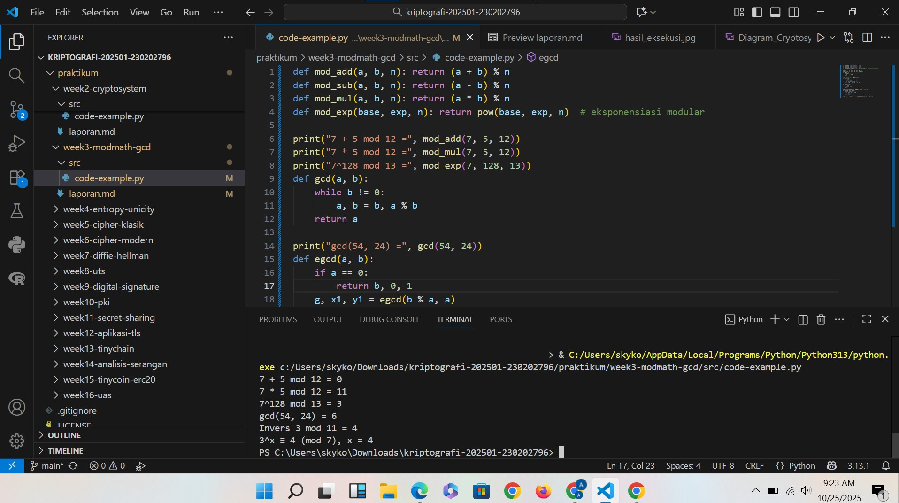

# Laporan Praktikum Kriptografi
Minggu ke-: 3
Topik: [Modular Math (Aritmetika Modular, GCD, Bilangan Prima, Logaritma Diskrit)]  
Nama: [Adelya Ayu Virnanda]  
NIM: [230202796]  
Kelas: [5IKRB]  

---

## 1. Tujuan

Setelah mengikuti praktikum ini, mahasiswa diharapkan mampu:

1. Menyelesaikan operasi aritmetika modular.
2. Menentukan bilangan prima dan menghitung GCD (Greatest Common Divisor).
3. Menerapkan logaritma diskrit sederhana dalam simulasi kriptografi.

## 2. Dasar Teori  
Contoh: definisi cipher klasik, konsep modular aritmetika, dll.  )

Cipher klasik adalah metode penyandian pesan yang digunakan pada masa sebelum adanya komputer modern. Dalam sistem ini, pesan asli atau plaintext diubah menjadi bentuk sandi atau ciphertext dengan menggunakan aturan tertentu yang bersifat manual dan sederhana. Cipher klasik biasanya bekerja dengan cara mengganti huruf-huruf dalam teks (substitution) atau menukar posisi huruf-hurufnya (transposition). 

Contoh dari cipher klasik antara lain adalah Caesar Cipher, yang menggeser setiap huruf beberapa posisi dalam alfabet, serta Vigenère Cipher, yang menggunakan kata kunci untuk menentukan pola pergeseran. Meskipun cipher klasik memiliki peran penting dalam sejarah kriptografi dan menjadi dasar bagi teknik enkripsi modern, metode ini kini dianggap tidak aman karena mudah dipecahkan menggunakan analisis frekuensi atau teknik dekripsi sederhana lainnya.


## 3. Alat dan Bahan
- Python 3.x  
- Visual Studio Code / editor lain  
- Git dan akun GitHub  

---

## 4. Langkah Percobaan
1. Membuat struktur folder praktikum/week3-modmath-gcd/src/ dan file modular_math.py.
2. Tambahkan fungsi-fungsi aritmetika modular seperti mod_add, mod_sub, mod_mul, dan mod_exp.
3. Mengimplementasikan algoritma Euclidean buat nyari nilai GCD.
4. Mengimplementasikan dengan Extended Euclidean Algorithm (egcd) dan bikin juga fungsi invers modular (modinv).
5. Tambahkan simulasi sederhana logaritma diskrit (discrete_log) untuk nyari nilai pangkat dalam sistem modular.
6. Jalankan programnya (python src/modular_math.py) buat menguji semua fungsi yang udah dibuat.
7.  Terakhir, screenshot hasil eksekusi dan simpan di folder screenshots/ sebagai bukti hasil praktikum.

---

## 5. Source Code
(Salin kode program utama yang dibuat atau dimodifikasi.  
Gunakan blok kode:

```python
def mod_add(a, b, n): return (a + b) % n
def mod_sub(a, b, n): return (a - b) % n
def mod_mul(a, b, n): return (a * b) % n
def mod_exp(base, exp, n): return pow(base, exp, n)  # eksponensiasi modular

print("7 + 5 mod 12 =", mod_add(7, 5, 12))
print("7 * 5 mod 12 =", mod_mul(7, 5, 12))
print("7^128 mod 13 =", mod_exp(7, 128, 13))
def gcd(a, b):
    while b != 0:
        a, b = b, a % b
    return a

print("gcd(54, 24) =", gcd(54, 24))
def egcd(a, b):
    if a == 0:
        return b, 0, 1
    g, x1, y1 = egcd(b % a, a)
    return g, y1 - (b // a) * x1, x1

def modinv(a, n):
    g, x, _ = egcd(a, n)
    if g != 1:
        return None
    return x % n

print("Invers 3 mod 11 =", modinv(3, 11))  # hasil: 4
def discrete_log(a, b, n):
    for x in range(n):
        if pow(a, x, n) == b:
            return x
    return None

print("3^x ≡ 4 (mod 7), x =", discrete_log(3, 4, 7))  # hasil: 4

```
)

---

## 6. Hasil dan Pembahasan
(- Lampirkan screenshot hasil eksekusi program (taruh di folder `screenshots/`).  
- Berikan tabel atau ringkasan hasil uji jika diperlukan.  
- Jelaskan apakah hasil sesuai ekspektasi.  
- Bahas error (jika ada) dan solusinya. 

Hasil eksekusi program Caesar Cipher:



)

---

## 7. Jawaban Pertanyaan
(Jawab pertanyaan diskusi yang diberikan pada modul. 
- Pertanyaan 1: Apa peran aritmetika modular dalam kriptografi modern?
Aritmetika modular memiliki peran yang sangat penting dalam kriptografi modern karena menjadi dasar dalam banyak algoritma enkripsi dan dekripsi. Dalam aritmetika modular, operasi matematika seperti penjumlahan, pengurangan, perkalian, dan perpangkatan dilakukan dengan sisa hasil bagi terhadap suatu bilangan tertentu yang disebut *modulus*. Konsep ini digunakan untuk menciptakan sistem kriptografi yang aman karena hasil operasinya sulit dibalik tanpa mengetahui kunci tertentu. Misalnya, pada algoritma RSA, aritmetika modular digunakan untuk proses enkripsi dan dekripsi dengan operasi perpangkatan besar terhadap modulus hasil perkalian dua bilangan prima besar. Hal ini membuat sistem kriptografi modern sangat bergantung pada kesulitan memecahkan persoalan matematika seperti faktorisasi bilangan prima atau logaritma diskrit, yang semuanya berakar pada aritmetika modular.


- Pertanyaan 2: Mengapa invers modular penting dalam algoritma kunci publik (misalnya RSA)?
Invers modular sangat penting dalam algoritma kunci publik seperti RSA karena digunakan untuk memastikan proses enkripsi dan dekripsi dapat saling membalikkan satu sama lain secara matematis. Dalam RSA, kunci publik digunakan untuk mengenkripsi pesan, sedangkan kunci privat digunakan untuk mendekripsi. Agar kedua proses ini bekerja dengan benar, dibutuhkan pasangan bilangan ( e ) (eksponen publik) dan ( d ) (eksponen privat) yang memiliki hubungan khusus, yaitu ( e \times d \equiv 1 \pmod{\varphi(n)} ), di mana ( \varphi(n) ) adalah fungsi totien Euler dari modulus ( n ).

Nilai ( d ) diperoleh sebagai invers modular dari ( e ) terhadap ( \varphi(n) ). Artinya, hanya ( d ) yang dapat “membatalkan” efek enkripsi yang dilakukan oleh ( e ). Tanpa invers modular ini, pesan yang telah dienkripsi tidak bisa dikembalikan ke bentuk aslinya secara aman. Oleh karena itu, invers modular menjadi kunci utama dalam menjaga keutuhan dan keamanan proses kriptografi pada algoritma seperti RSA.

)
- Pertanyaan 3: Apa tantangan utama dalam menyelesaikan logaritma diskrit untuk modulus besar?
Tantangan utama dalam menyelesaikan logaritma diskrit untuk modulus besar** terletak pada **kompleksitas perhitungannya yang sangat tinggi. Secara sederhana, masalah logaritma diskrit adalah mencari nilai ( x ) dari persamaan ( g^x \equiv h \pmod{p} ), di mana ( g ), ( h ), dan ( p ) diketahui. Untuk modulus besar (terutama ketika ( p ) adalah bilangan prima dengan ratusan atau ribuan bit), tidak ada algoritma efisien yang dapat menemukan ( x ) dengan cepat.

Kesulitannya muncul karena operasi perpangkatan modular mudah dilakukan, tetapi proses kebalikannya (mencari logaritma diskrit) sangat sulit dan memerlukan waktu komputasi yang luar biasa besar. Algoritma brute force atau metode pencarian biasa menjadi tidak praktis karena jumlah kemungkinan nilai ( x ) sangat banyak. Inilah alasan mengapa banyak sistem kriptografi modern seperti Diffie–Hellman dan ElGamal mengandalkan kesulitan logaritma diskrit untuk menjamin keamanan — karena meskipun operasi enkripsi mudah dilakukan, memecahkannya tanpa kunci privat hampir mustahil dalam waktu yang wajar.

---

## 8. Kesimpulan
Kesimpulannya, modular math atau aritmetika modular merupakan dasar penting dalam kriptografi modern karena memungkinkan operasi matematika dilakukan dalam sistem bilangan terbatas (*modulus*). Konsep ini digunakan untuk menjaga keamanan dan efisiensi dalam proses enkripsi serta dekripsi. GCD (Greatest Common Divisor) berperan dalam menentukan hubungan antara dua bilangan, misalnya untuk memastikan pembentukan kunci yang valid dalam algoritma RSA. Bilangan prima menjadi elemen penting karena digunakan untuk membangun kunci yang sulit dipecahkan, terutama dalam sistem kunci publik. Sementara itu, logaritma diskrit adalah masalah matematika yang sulit diselesaikan dan menjadi dasar keamanan pada algoritma seperti Diffie-Hellman dan ElGamal. Secara keseluruhan, keempat konsep ini saling berkaitan dan membentuk fondasi kuat bagi keamanan kriptografi modern.

---

## 9. Daftar Pustaka
(Cantumkan referensi yang digunakan.  
Contoh:  
- Katz, J., & Lindell, Y. *Introduction to Modern Cryptography*.  
- Stallings, W. *Cryptography and Network Security*.  )

---

## 10. Commit Log
```
commit abc12345
Author: Adelya Ayu Virnanda <adelyavirnanda@gmail.com>
Date:   2025-10-25

    week2-cryptosystem: implementasi Caesar Cipher dan laporan )
```
