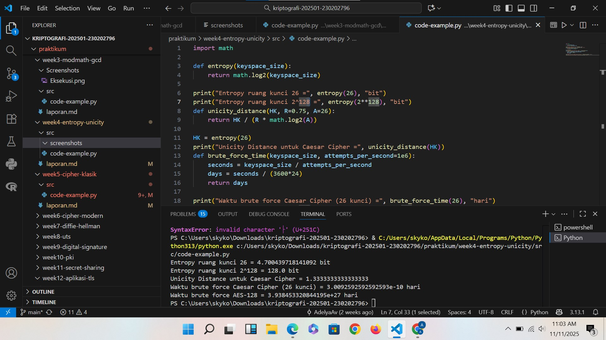

# Laporan Praktikum Kriptografi
Minggu ke-: X  
Topik: [04 Entropy & Unicity Distance (Evaluasi Kekuatan Kunci dan Brute Force)]  
Nama: [Nama Mahasiswa]  
NIM: [NIM Mahasiswa]  
Kelas: [Kelas]  

---

## 1. Tujuan
Setelah mengikuti praktikum ini, mahasiswa diharapkan mampu:

1. Menyelesaikan perhitungan sederhana terkait entropi kunci.
2. Menggunakan teorema Euler pada contoh perhitungan modular & invers.
3. Menghitung unicity distance untuk ciphertext tertentu.
4. Menganalisis kekuatan kunci berdasarkan entropi dan unicity distance.
5. Mengevaluasi potensi serangan brute force pada kriptosistem sederhana.1. 

---

## 2. Dasar Teori
Modular aritmetika adalah sistem operasi hitung yang bekerja dengan nilai sisa pembagian terhadap suatu bilangan tertentu yang disebut modulus. Dua bilangan dikatakan kongruen jika memiliki sisa pembagian yang sama terhadap modulus, ditulis sebagai ( a \equiv b \pmod{n} ). Operasi seperti penjumlahan, pengurangan, dan perkalian dilakukan seperti biasa, tetapi hasilnya diambil berdasarkan sisa bagi terhadap modulus. Konsep ini penting dalam kriptografi modern, seperti pada algoritma RSA, karena memungkinkan proses enkripsi yang aman melalui operasi matematika yang sulit dibalik.


---

## 3. Alat dan Bahan
(- Python 3.x  
- Visual Studio Code / editor lain  
- Git dan akun GitHub  


---

## 4. Langkah Percobaan
(Tuliskan langkah yang dilakukan sesuai instruksi.  
Contoh format:
1. Membuat file `caesar_cipher.py` di folder `praktikum/week2-cryptosystem/src/`.
2. Menyalin kode program dari panduan praktikum.
3. Menjalankan program dengan perintah `python caesar_cipher.py`.)

---

## 5. Source Code
(Salin kode program utama yang dibuat atau dimodifikasi.  
Gunakan blok kode:

```python
import math

def entropy(keyspace_size):
    return math.log2(keyspace_size)

print("Entropy ruang kunci 26 =", entropy(26), "bit")
print("Entropy ruang kunci 2^128 =", entropy(2**128), "bit")
def unicity_distance(HK, R=0.75, A=26):
    return HK / (R * math.log2(A))

HK = entropy(26)
print("Unicity Distance untuk Caesar Cipher =", unicity_distance(HK))
def brute_force_time(keyspace_size, attempts_per_second=1e6):
    seconds = keyspace_size / attempts_per_second
    days = seconds / (3600*24)
    return days

print("Waktu brute force Caesar Cipher (26 kunci) =", brute_force_time(26), "hari")
print("Waktu brute force AES-128 =", brute_force_time(2**128), "hari")
```
)

---

## 6. Hasil dan Pembahasan
(- Lampirkan screenshot hasil eksekusi program (taruh di folder `screenshots/`).  
- Berikan tabel atau ringkasan hasil uji jika diperlukan.  
- Jelaskan apakah hasil sesuai ekspektasi.  
- Bahas error (jika ada) dan solusinya. 

Hasil eksekusi program Caesar Cipher:


)

---

## 7. Jawaban Pertanyaan
(Jawab pertanyaan diskusi yang diberikan pada modul.  
- Pertanyaan 1: Apa arti dari nilai entropy dalam konteks kekuatan kunci?
Nilai entropy dalam konteks kekuatan kunci menunjukkan tingkat ketidakpastian atau keacakan dari sebuah kunci kriptografi. Semakin tinggi nilai entropinya, semakin sulit kunci tersebut ditebak atau diprediksi oleh penyerang. Dengan kata lain, entropi mencerminkan seberapa kuat dan aman suatu kunci terhadap serangan brute force. Kunci dengan entropi rendah mudah ditebak karena memiliki pola atau keteraturan, sedangkan kunci dengan entropi tinggi bersifat acak dan lebih aman digunakan dalam sistem kriptografi.

- Pertanyaan 2: Mengapa unicity distance penting dalam menentukan keamanan suatu cipher?
Unicity distance penting karena menunjukkan jumlah minimum ciphertext yang dibutuhkan agar penyerang dapat menentukan kunci enkripsi secara unik. Jika panjang ciphertext melebihi unicity distance, maka kemungkinan besar hanya ada satu kunci yang cocok dengan pesan tersebut, sehingga cipher bisa ditembus. Sebaliknya, jika panjang ciphertext masih lebih pendek dari unicity distance, banyak kunci lain yang mungkin, sehingga pesan tetap aman. Dengan demikian, unicity distance membantu mengukur tingkat keamanan suatu cipher terhadap analisis kriptografi berdasarkan panjang data terenkripsi yang tersedia.

- Pertanyaan 3:Mengapa brute force masih menjadi ancaman meskipun algoritma sudah kuat?
Brute force masih menjadi ancaman meskipun algoritma sudah kuat karena metode ini tidak bergantung pada kelemahan algoritma, melainkan mencoba semua kemungkinan kunci hingga menemukan yang benar. Jika panjang atau kompleksitas kunci kurang besar, brute force tetap bisa berhasil dengan waktu dan sumber daya komputasi yang cukup. Selain itu, kemajuan teknologi seperti komputer kuantum dan peningkatan daya komputasi membuat serangan brute force semakin cepat. Oleh karena itu, penting untuk menggunakan ukuran kunci yang cukup panjang dan acak agar waktu yang dibutuhkan untuk brute force menjadi tidak praktis.


)

---

## 8. Kesimpulan
Entropy & Unicity Distance (Evaluasi Kekuatan Kunci dan Brute Force)

Kesimpulan, entropy dan unicity distance berperan penting dalam mengevaluasi kekuatan kunci terhadap serangan brute force. Entropy menunjukkan tingkat keacakan dan ketidakpastian kunci—semakin tinggi entropinya, semakin sulit kunci ditebak. Sementara itu, unicity distance menentukan seberapa banyak ciphertext yang dibutuhkan agar kunci dapat dipecahkan secara unik. Kombinasi keduanya membantu menilai seberapa kuat sistem kriptografi menahan upaya penyerangan, sehingga semakin tinggi entropi dan semakin besar unicity distance, maka semakin aman cipher dari brute force maupun analisis kriptografi.


---

## 9. Daftar Pustaka
(Cantumkan referensi yang digunakan.  
Contoh:  
- Katz, J., & Lindell, Y. *Introduction to Modern Cryptography*.  
- Stallings, W. *Cryptography and Network Security*.  )

---

## 10. Commit Log
(Tuliskan bukti commit Git yang relevan.  
Contoh:
```
commit abc12345
Author: Adelya Ayu Virnanda <adelyavirnanda@gmail.com>
Date:   2025-010-25

    week2-cryptosystem: implementasi Caesar Cipher dan laporan )
```
