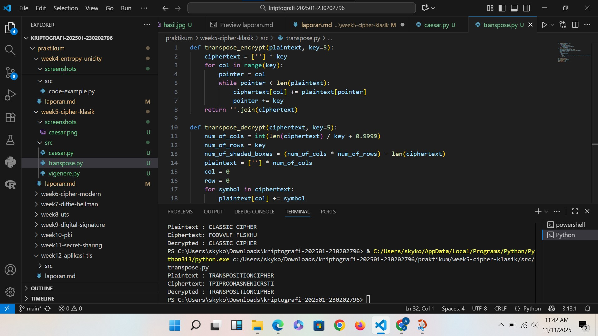
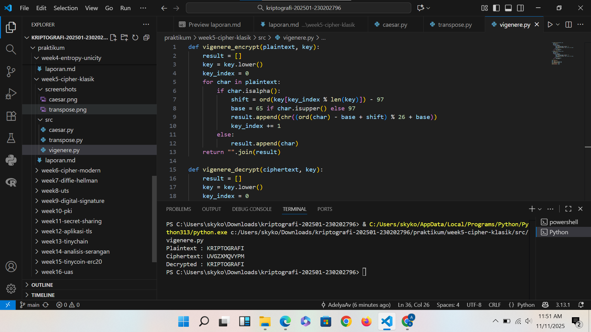

# Laporan Praktikum Kriptografi
Minggu ke-: 5
Topik: [05 Cipher Klasik (Caesar, Vigenère, Transposisi)]  
Nama: [Adelya Ayu Virnanda]  
NIM: [230202796]  
Kelas: [5IKRB]  

---

## 1. Tujuan
(Tuliskan tujuan pembelajaran praktikum sesuai modul.)
1. Menerapkan algoritma Caesar Cipher untuk enkripsi dan dekripsi teks.
2. Menerapkan algoritma Vigenère Cipher dengan variasi kunci.
3. Mengimplementasikan algoritma transposisi sederhana.
4. Menjelaskan kelemahan algoritma kriptografi klasik.

---

## 2. Dasar Teori
(Ringkas teori relevan (cukup 2–3 paragraf).  
Contoh: definisi cipher klasik, konsep modular aritmetika, dll.  )
Cipher klasik adalah metode enkripsi yang digunakan sebelum era komputer, di mana pesan hanya diproses berbasis huruf alfabet dan menggunakan teknik seperti substitusi atau transposisi untuk menyamarkan isi pesan.
 Metode ini termasuk dalam kriptografi kunci-simetri, artinya kunci yang digunakan untuk mengenkripsi dan mendekripsi pesan adalah sama. Contoh cipher klasik antara lain Caesar Cipher, Vigenere Cipher, dan Playfair Cipher, yang masing-masing memiliki cara berbeda dalam mengganti atau mengatur urutan huruf. Meskipun cipher klasik saat ini dianggap tidak aman untuk digunakan secara luas, namun tetap penting sebagai dasar pemahaman kriptografi dan menjadi fondasi bagi pengembangan algoritma modern.

 ---

## 3. Alat dan Bahan
(- Python 3.x  
- Visual Studio Code / editor lain  
- Git dan akun GitHub  

---

## 4. Langkah Percobaan
(Tuliskan langkah yang dilakukan sesuai instruksi.  
Contoh format:
1. Membuat file `caesar_cipher.py` di folder `praktikum/week2-cryptosystem/src/`.
2. Menyalin kode program dari panduan praktikum.
3. Menjalankan program dengan perintah `python caesar_cipher.py`.)

---

## 5. Source Code
(Salin kode program utama yang dibuat atau dimodifikasi.  
Gunakan blok kode:

```python
def caesar_encrypt(plaintext, key):
    result = ""
    for char in plaintext:
        if char.isalpha():
            shift = 65 if char.isupper() else 97
            result += chr((ord(char) - shift + key) % 26 + shift)
        else:
            result += char
    return result

def caesar_decrypt(ciphertext, key):
    return caesar_encrypt(ciphertext, -key)

# Contoh uji
msg = "CLASSIC CIPHER"
key = 3
enc = caesar_encrypt(msg, key)
dec = caesar_decrypt(enc, key)
print("Plaintext :", msg)
print("Ciphertext:", enc)
print("Decrypted :", dec)
```

```python
def transpose_encrypt(plaintext, key=5):
    ciphertext = [''] * key
    for col in range(key):
        pointer = col
        while pointer < len(plaintext):
            ciphertext[col] += plaintext[pointer]
            pointer += key
    return ''.join(ciphertext)

def transpose_decrypt(ciphertext, key=5):
    num_of_cols = int(len(ciphertext) / key + 0.9999)
    num_of_rows = key
    num_of_shaded_boxes = (num_of_cols * num_of_rows) - len(ciphertext)
    plaintext = [''] * num_of_cols
    col = 0
    row = 0
    for symbol in ciphertext:
        plaintext[col] += symbol
        col += 1
        if (col == num_of_cols) or (col == num_of_cols - 1 and row >= num_of_rows - num_of_shaded_boxes):
            col = 0
            row += 1
    return ''.join(plaintext)

# Contoh uji
msg = "TRANSPOSITIONCIPHER"
enc = transpose_encrypt(msg, key=5)
dec = transpose_decrypt(enc, key=5)
print("Plaintext :", msg)
print("Ciphertext:", enc)
print("Decrypted :", dec)
```

```python
def vigenere_encrypt(plaintext, key):
    result = []
    key = key.lower()
    key_index = 0
    for char in plaintext:
        if char.isalpha():
            shift = ord(key[key_index % len(key)]) - 97
            base = 65 if char.isupper() else 97
            result.append(chr((ord(char) - base + shift) % 26 + base))
            key_index += 1
        else:
            result.append(char)
    return "".join(result)

def vigenere_decrypt(ciphertext, key):
    result = []
    key = key.lower()
    key_index = 0
    for char in ciphertext:
        if char.isalpha():
            shift = ord(key[key_index % len(key)]) - 97
            base = 65 if char.isupper() else 97
            result.append(chr((ord(char) - base - shift) % 26 + base))
            key_index += 1
        else:
            result.append(char)
    return "".join(result)

# Contoh uji
msg = "KRIPTOGRAFI"
key = "KEY"
enc = vigenere_encrypt(msg, key)
dec = vigenere_decrypt(enc, key)
print("Plaintext :", msg)
print("Ciphertext:", enc)
print("Decrypted :", dec)
```
)

---

## 6. Hasil dan Pembahasan
(- Lampirkan screenshot hasil eksekusi program (taruh di folder `screenshots/`).  
- Berikan tabel atau ringkasan hasil uji jika diperlukan.  
- Jelaskan apakah hasil sesuai ekspektasi.  
- Bahas error (jika ada) dan solusinya. 

Hasil eksekusi program Caesar Cipher:




)

---

## 7. Jawaban Pertanyaan
(Jawab pertanyaan diskusi yang diberikan pada modul.  
- Pertanyaan 1: Apa kelemahan utama algoritma Caesar Cipher dan Vigenère Cipher?
Algoritma Caesar Cipher dan Vigenère Cipher memiliki kelemahan utama berupa tingkat keamanan yang rendah karena mudah dipecahkan dengan serangan brute force dan analisis frekuensi. Caesar Cipher hanya memiliki 25 kemungkinan kunci, sehingga sangat rentan terhadap serangan brute force dan pola penggeseran yang tetap memudahkan analisis frekuensi huruf. Sementara itu, Vigenère Cipher memang lebih kuat karena menggunakan kunci yang berulang, tetapi jika panjang kunci lebih pendek dari pesan, maka pola kunci akan terulang dan dapat dianalisis dengan metode Kasiski atau analisis frekuensi. Kedua algoritma ini tidak cocok untuk melindungi data sensitif di era modern karena mudah dipecahkan dan tidak mampu menahan serangan kriptanalisis yang lebih canggih.
- Pertanyaan 2: Mengapa cipher klasik mudah diserang dengan analisis frekuensi?
Cipher klasik mudah diserang dengan analisis frekuensi karena metode enkripsi yang digunakan (seperti Caesar Cipher dan Vigenère Cipher) hanya mengubah atau mengganti huruf tanpa mengubah pola distribusi frekuensi huruf asli dalam bahasa tertentu. Dalam setiap bahasa, ada huruf-huruf tertentu yang muncul lebih sering, misalnya huruf 'A' dan 'N' di Bahasa Indonesia atau 'E' di Bahasa Inggris. Serangan analisis frekuensi memanfaatkan pola ini dengan menghitung frekuensi kemunculan huruf dalam ciphertext, lalu membandingkannya dengan tabel frekuensi huruf pada bahasa aslinya. Dengan demikian, penyerang dapat menebak huruf mana yang kemungkinan besar mewakili huruf yang paling sering muncul di plaintext, sehingga memudahkan proses pemecahan kunci dan dekripsi pesan.
- Pertanyaan 3: Bandingkan kelebihan dan kelemahan cipher substitusi vs transposisi.
Cipher substitusi dan transposisi memiliki kelebihan serta kelemahan yang berbeda. Cipher substitusi mengganti setiap huruf atau simbol dalam plaintext dengan huruf atau simbol lain berdasarkan kunci tertentu, sehingga kelebihannya adalah proses enkripsi dan dekripsi yang relatif sederhana serta mudah diimplementasikan secara manual atau komputer. Namun, kelemahannya adalah tetap mempertahankan pola frekuensi huruf asli, sehingga sangat rentan terhadap serangan analisis frekuensi.[2][5][6]

Sementara itu, cipher transposisi mengacak urutan huruf dalam plaintext tanpa mengubah identitas hurufnya, sehingga kelebihannya adalah tidak mengubah distribusi frekuensi huruf, membuat analisis frekuensi menjadi kurang efektif. Namun, kelemahannya adalah jika struktur atau pola pengacakan tidak cukup rumit, pesan masih bisa ditebak atau dipecahkan dengan metode lain seperti anagram atau serangan known plaintext. Dengan demikian, cipher transposisi lebih aman dari analisis frekuensi, tetapi bisa lebih rentan terhadap serangan lain jika kunci atau metode pengacakan tidak kuat.

---

## 8. Kesimpulan
(Tuliskan kesimpulan singkat (2–3 kalimat) berdasarkan percobaan.  )
Cipher klasik seperti Caesar, Vigenère, dan Transposisi memiliki karakteristik masing-masing yang membedakan kelebihan dan kelemahannya. Caesar Cipher dan Vigenère Cipher termasuk dalam kategori substitusi, yaitu mengganti huruf dengan huruf lain berdasarkan kunci tertentu, sehingga mudah diimplementasikan tetapi rentan terhadap analisis frekuensi karena pola distribusi huruf asli tetap terlihat. Sementara itu, cipher transposisi mengacak urutan huruf tanpa mengubah identitasnya, sehingga lebih tahan terhadap analisis frekuensi, tetapi bisa lebih mudah dipecahkan jika pola pengacakan tidak rumit. Secara umum, cipher klasik memiliki kelebihan dalam kesederhanaan dan kemudahan proses enkripsi-dekripsi, namun kelemahannya adalah tingkat keamanan yang rendah terhadap serangan modern seperti analisis frekuensi dan brute force, sehingga tidak cocok untuk melindungi data sensitif di era digital.

---

## 9. Daftar Pustaka
(Cantumkan referensi yang digunakan.  
Contoh:  
- Katz, J., & Lindell, Y. *Introduction to Modern Cryptography*.  
- Stallings, W. *Cryptography and Network Security*.  )

---

## 10. Commit Log
(Tuliskan bukti commit Git yang relevan.  
Contoh:
```
commit abc12345
Author: Adelya Ayu Virnanda <adelyavirnanda@gmail.com>
Date:   2025-11-11

    week2-cryptosystem: implementasi Caesar Cipher dan laporan )
```
