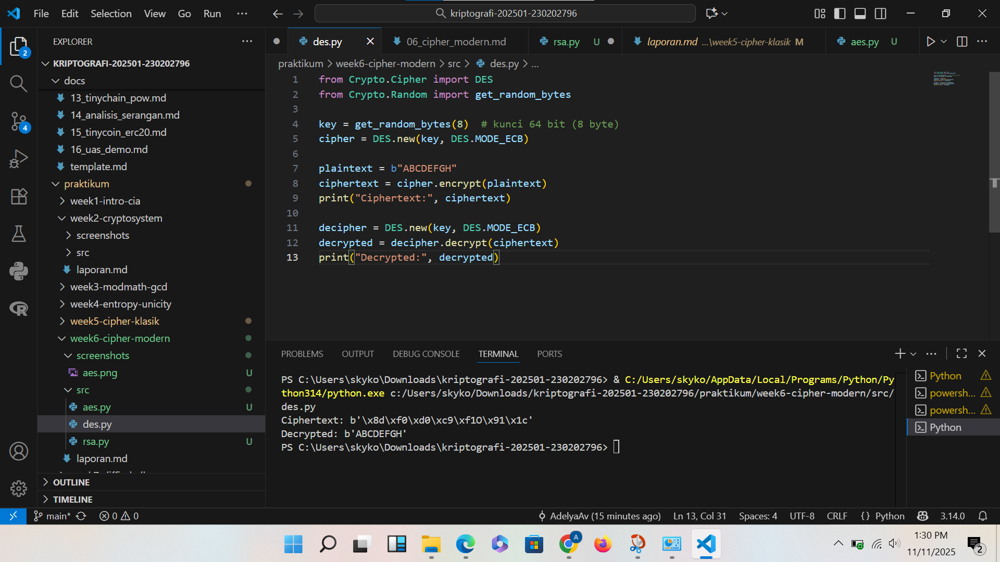
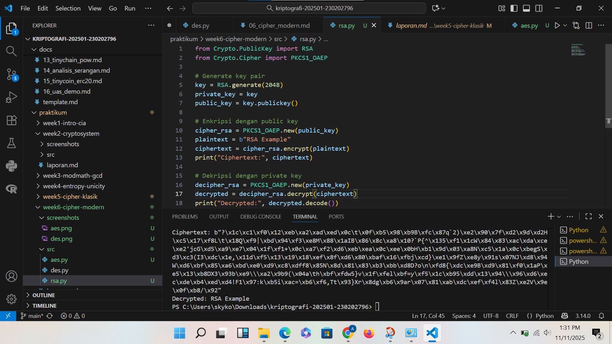

# Laporan Praktikum Kriptografi
Minggu ke-: 6  
Topik: [06 Cipher Modern (DES, AES, RSA)]  
Nama: [Adelya Ayu Virnanda]  
NIM: [230202796] 
Kelas: [5IKRB]  

---

## 1. Tujuan
Setelah mengikuti praktikum ini, mahasiswa diharapkan mampu:  
1. Mengimplementasikan algoritma **DES** untuk blok data sederhana.  
2. Menerapkan algoritma **AES** dengan panjang kunci 128 bit.  
3. Menjelaskan proses pembangkitan kunci publik dan privat pada algoritma **RSA**. 

## 2. Dasar Teori
Dasar teori cipher modern (DES, AES, dan RSA) berlandaskan pada prinsip kriptografi modern, yaitu ilmu yang mempelajari teknik untuk menjaga kerahasiaan, integritas, dan keaslian data melalui proses enkripsi dan dekripsi. Cipher modern terbagi menjadi dua jenis utama, yaitu kriptografi simetris dan kriptografi asimetris.

Pada kriptografi simetris, proses enkripsi dan dekripsi menggunakan kunci yang sama. Contohnya adalah DES (Data Encryption Standard) dan AES (Advanced Encryption Standard). DES menggunakan struktur Feistel network dengan panjang kunci 56-bit, sedangkan AES menggunakan substitution-permutation network (SPN) dengan panjang kunci 128, 192, atau 256-bit. AES menjadi standar enkripsi modern karena lebih kuat dan efisien dibanding DES.

Sementara itu, kriptografi asimetris menggunakan dua kunci berbeda, yaitu kunci publik dan kunci privat. Contohnya adalah RSA (Rivest–Shamir–Adleman) yang didasarkan pada konsep faktorisasi bilangan prima besar. Dalam RSA, kunci publik digunakan untuk enkripsi dan kunci privat untuk dekripsi, sehingga cocok untuk keamanan komunikasi dan autentikasi data.

Secara keseluruhan, teori dasar cipher modern bertumpu pada konsep matematika kompleks seperti aritmetika modular, teori bilangan prima, serta fungsi non-linear yang sulit dibalik. Prinsip-prinsip ini memastikan bahwa proses enkripsi tidak dapat dengan mudah dipecahkan tanpa kunci yang benar, menjadikan cipher modern sebagai fondasi utama dalam sistem keamanan informasi masa kini.

---

## 3. Alat dan Bahan
(- Python 3.x  
- Visual Studio Code / editor lain  
- Git dan akun GitHub  
- Library tambahan (misalnya pycryptodome, jika diperlukan)  )

---

## 4. Langkah Percobaan
(Tuliskan langkah yang dilakukan sesuai instruksi.  
Contoh format:
1. Membuat file `caesar_cipher.py` di folder `praktikum/week2-cryptosystem/src/`.
2. Menyalin kode program dari panduan praktikum.
3. Menjalankan program dengan perintah `python caesar_cipher.py`.)

---

## 5. Source Code
(Salin kode program utama yang dibuat atau dimodifikasi.  
Gunakan blok kode:

```python
from Crypto.Cipher import AES
from Crypto.Random import get_random_bytes

key = get_random_bytes(16)  # 128 bit key
cipher = AES.new(key, AES.MODE_EAX)

plaintext = b"Modern Cipher AES Example"
ciphertext, tag = cipher.encrypt_and_digest(plaintext)

print("Ciphertext:", ciphertext)

# Dekripsi
cipher_dec = AES.new(key, AES.MODE_EAX, nonce=cipher.nonce)
decrypted = cipher_dec.decrypt(ciphertext)
print("Decrypted:", decrypted.decode())
```

```python
from Crypto.Cipher import DES
from Crypto.Random import get_random_bytes

key = get_random_bytes(8)  # kunci 64 bit (8 byte)
cipher = DES.new(key, DES.MODE_ECB)

plaintext = b"ABCDEFGH"
ciphertext = cipher.encrypt(plaintext)
print("Ciphertext:", ciphertext)

decipher = DES.new(key, DES.MODE_ECB)
decrypted = decipher.decrypt(ciphertext)
print("Decrypted:", decrypted)
```

```python
from Crypto.PublicKey import RSA
from Crypto.Cipher import PKCS1_OAEP

# Generate key pair
key = RSA.generate(2048)
private_key = key
public_key = key.publickey()

# Enkripsi dengan public key
cipher_rsa = PKCS1_OAEP.new(public_key)
plaintext = b"RSA Example"
ciphertext = cipher_rsa.encrypt(plaintext)
print("Ciphertext:", ciphertext)

# Dekripsi dengan private key
decipher_rsa = PKCS1_OAEP.new(private_key)
decrypted = decipher_rsa.decrypt(ciphertext)
print("Decrypted:", decrypted.decode())
```
)

---

## 6. Hasil dan Pembahasan
(- Lampirkan screenshot hasil eksekusi program (taruh di folder `screenshots/`).  
- Berikan tabel atau ringkasan hasil uji jika diperlukan.  
- Jelaskan apakah hasil sesuai ekspektasi.  
- Bahas error (jika ada) dan solusinya. 

Hasil eksekusi program Caesar Cipher:




)

---

## 7. Jawaban Pertanyaan
(Jawab pertanyaan diskusi yang diberikan pada modul.  
- Pertanyaan 1: Apa perbedaan mendasar antara DES, AES, dan RSA dalam hal kunci dan keamanan?
Perbedaan mendasar antara DES, AES, dan RSA terletak pada jenis algoritma, penggunaan kunci, serta tingkat keamanannya. DES (Data Encryption Standard) dan AES (Advanced Encryption Standard) termasuk dalam kategori kriptografi simetris, di mana proses enkripsi dan dekripsi menggunakan kunci yang sama. Perbedaannya, DES menggunakan kunci sepanjang 56 bit yang kini dianggap tidak aman karena dapat dipecahkan dengan serangan brute force, sedangkan AES menggunakan kunci 128, 192, atau 256 bit yang jauh lebih kuat dan menjadi standar enkripsi modern yang diakui oleh NIST. Di sisi lain, RSA (Rivest–Shamir–Adleman) merupakan algoritma kriptografi asimetris, yang menggunakan dua kunci berbeda, yaitu kunci publik untuk enkripsi dan kunci privat untuk dekripsi. RSA memiliki panjang kunci jauh lebih besar, umumnya 2048 bit atau lebih, dan meskipun lebih aman untuk pertukaran kunci atau tanda tangan digital, algoritma ini lebih lambat dibanding AES. Dalam praktiknya, RSA sering digunakan untuk mengamankan pertukaran kunci AES, sedangkan AES digunakan untuk mengenkripsi data utama karena efisiensinya. Dengan demikian, AES saat ini menjadi standar utama untuk enkripsi data, RSA digunakan untuk pengamanan kunci dan otentikasi, sementara DES sudah dianggap usang dan jarang dipakai karena kelemahannya.

- Pernyataan 2: Mengapa AES lebih banyak digunakan dibanding DES di era modern?
AES (Advanced Encryption Standard) lebih banyak digunakan dibanding DES (Data Encryption Standard) di era modern karena menawarkan tingkat keamanan yang jauh lebih tinggi dan efisiensi yang lebih baik. DES memiliki panjang kunci hanya 56-bit, sehingga mudah diretas menggunakan serangan *brute force* oleh komputer modern. Sebaliknya, AES menggunakan panjang kunci 128, 192, atau 256-bit, yang membuatnya sangat sulit dibobol. Selain itu, struktur algoritma AES yang berbasis *substitusi-permutasi network* (SPN) memberikan tingkat keamanan lebih kuat dibanding struktur *Feistel* pada DES. AES juga lebih efisien dalam proses enkripsi dan dekripsi, baik di perangkat keras maupun perangkat lunak, sehingga cocok digunakan di berbagai platform seperti komputer, ponsel, dan perangkat IoT. Karena keunggulan-keunggulan tersebut, AES ditetapkan oleh NIST sebagai standar enkripsi modern yang menggantikan DES dan kini menjadi pilihan utama dalam menjaga kerahasiaan data digital.

- Pernyataan 3: Mengapa RSA dikategorikan sebagai algoritma asimetris, dan bagaimana proses pembangkitan kuncinya?
RSA dikategorikan sebagai algoritma asimetris karena menggunakan dua kunci yang berbeda, yaitu kunci publik untuk enkripsi dan kunci privat untuk dekripsi. Kedua kunci ini saling berkaitan secara matematis, tetapi tidak mungkin menurunkan kunci privat hanya dari kunci publik, sehingga keamanan tetap terjaga. Proses pembangkitan kunci RSA dimulai dengan memilih dua bilangan prima besar (p) dan (q), lalu menghitung nilai modulus (n = p \times q) dan totien Euler (\varphi(n) = (p - 1)(q - 1)). Setelah itu, dipilih kunci publik (e) yang relatif prima terhadap (\varphi(n)), kemudian dihitung kunci privat (d) sebagai invers modular dari (e) terhadap (\varphi(n)). Hasil akhirnya adalah pasangan kunci publik ((e, n)) dan kunci privat ((d, n)). Dengan sistem ini, RSA memungkinkan proses enkripsi dan dekripsi dilakukan dengan kunci yang berbeda, sehingga data dapat dikirim dengan aman tanpa perlu berbagi kunci rahasia terlebih dahulu.

---

## 8. Kesimpulan
(Tuliskan kesimpulan singkat (2–3 kalimat) berdasarkan percobaan.  )
Kesimpulannya, cipher modern seperti DES, AES, dan RSA merupakan dasar utama dalam menjaga keamanan data di era digital. DES menjadi pionir algoritma enkripsi modern, namun kini dianggap kurang aman karena panjang kuncinya yang pendek. AES hadir sebagai penerus yang lebih kuat, cepat, dan efisien dengan panjang kunci hingga 256-bit, sehingga menjadi standar enkripsi simetris yang banyak digunakan saat ini. 
Sementara itu, RSA mewakili algoritma asimetris yang menggunakan pasangan kunci publik dan privat, memungkinkan pertukaran data yang aman tanpa berbagi kunci rahasia. Secara keseluruhan, ketiga algoritma ini menunjukkan perkembangan teknologi kriptografi dari segi keamanan, efisiensi, dan fleksibilitas, yang sangat penting dalam melindungi informasi di berbagai sistem modern.

---

## 9. Daftar Pustaka
(Cantumkan referensi yang digunakan.  
Contoh:  
- Katz, J., & Lindell, Y. *Introduction to Modern Cryptography*.  
- Stallings, W. *Cryptography and Network Security*.  )

---

## 10. Commit Log
```
commit 9503301ada2acc4a1a1c55bd7999f019eb9a36c9 (HEAD -> main, origin/main, origin/HEAD)
Author: AdelyaAv <adelya@gmail.com>
Date:   Tue Nov 11 13:53:00 2025 +0700

    week6-cipher-modern
```
