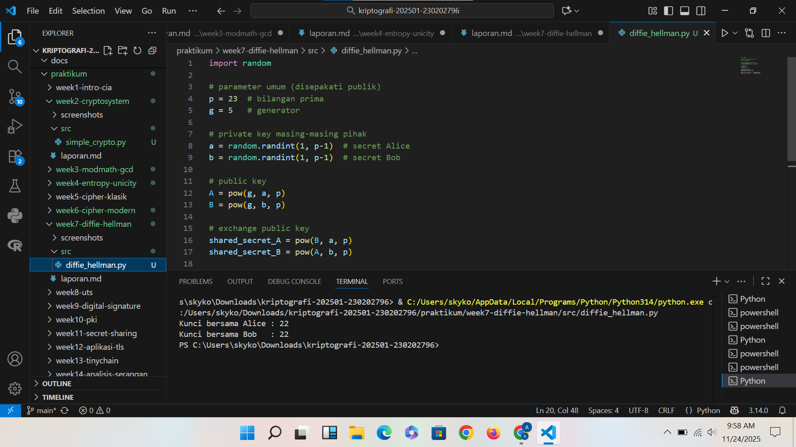

# Laporan Praktikum Kriptografi
Minggu ke-: 7
Topik: [07 Diffie-Hellman Key Exchange]  
Nama: [Adelya Ayu Virnanda]  
NIM: [230202796]  
Kelas: [5IKRB]  

---

## 1. Tujuan
1. Melakukan simulasi protokol Diffie-Hellman untuk pertukaran kunci publik.
2. Menjelaskan mekanisme pertukaran kunci rahasia menggunakan bilangan prima dan logaritma diskrit.
3. Menganalisis potensi serangan pada protokol Diffie-Hellman (termasuk serangan Man-in-the-Middle / MITM).

---

## 2. Dasar Teori
1. Program Python simulasi pertukaran kunci Diffie-Hellman.
2. Analisis keamanan (kelemahan dan potensi serangan).
3. Laporan singkat hasil percobaan dan analisis.
4. Commit Git dengan format week7-diffie-hellman.

---

## 3. Alat dan Bahan
(- Python 3.x  
- Visual Studio Code / editor lain  
- Git dan akun GitHub  
- Library tambahan (misalnya pycryptodome, jika diperlukan)  )

---

## 4. Langkah Percobaan
(Tuliskan langkah yang dilakukan sesuai instruksi.  
Contoh format:
1. Membuat file `diffie_hellman.py` di folder `praktikum/week7-diffie-hellman/src/`.
2. Menyalin kode program dari panduan praktikum.
3. Menjalankan program dengan perintah `python diffie_hellman.py`.)

---

## 5. Source Code
(Salin kode program utama yang dibuat atau dimodifikasi.  
Gunakan blok kode:

```python
import random

# parameter umum (disepakati publik)
p = 23  # bilangan prima
g = 5   # generator

# private key masing-masing pihak
a = random.randint(1, p-1)  # secret Alice
b = random.randint(1, p-1)  # secret Bob

# public key
A = pow(g, a, p)
B = pow(g, b, p)

# exchange public key
shared_secret_A = pow(B, a, p)
shared_secret_B = pow(A, b, p)

print("Kunci bersama Alice :", shared_secret_A)
print("Kunci bersama Bob   :", shared_secret_B)
```
)

---

## 6. Hasil dan Pembahasan
(- Lampirkan screenshot hasil eksekusi program (taruh di folder `screenshots/`).  
- Berikan tabel atau ringkasan hasil uji jika diperlukan.  
- Jelaskan apakah hasil sesuai ekspektasi.  
- Bahas error (jika ada) dan solusinya. 

Hasil eksekusi program Caesar Cipher:


)

---

## 7. Jawaban Pertanyaan
(Jawab pertanyaan diskusi yang diberikan pada modul.  
- Pertanyaan 1: Mengapa Diffie-Hellman memungkinkan pertukaran kunci di saluran publik?
Diffie–Hellman memungkinkan pertukaran kunci melalui saluran publik karena metode ini tidak pernah mengirimkan kunci rahasia secara langsung. Setiap pihak hanya mengirimkan nilai publik yang merupakan hasil perpangkatan modulo, sehingga penyerang yang menyadap komunikasi hanya melihat nilai yang secara matematis sangat sulit dibalik untuk menemukan kunci privat. Keamanan Diffie–Hellman bergantung pada *Discrete Logarithm Problem*, yaitu masalah matematika yang mudah dilakukan ke satu arah (menghitung ( g^a \mod p )) tetapi hampir mustahil dibalik untuk menemukan nilai ( a ). Karena kedua pihak kemudian menghitung kunci bersama menggunakan nilai privat masing-masing, mereka dapat menghasilkan kunci yang sama tanpa pernah mengungkapkan rahasia tersebut. Dengan mekanisme ini, Diffie–Hellman tetap aman meskipun seluruh proses pertukaran dilakukan di saluran yang tidak aman atau publik.

- Pertanyaan 2: Apa kelemahan utama protokol Diffie-Hellman murni?
Kelemahan utama protokol Diffie–Hellman murni adalah rentan terhadap serangan Man-in-the-Middle (MitM) karena protokol ini tidak menyediakan mekanisme autentikasi. Dalam DH murni, kedua pihak hanya bertukar nilai publik tanpa ada cara untuk memastikan bahwa nilai tersebut benar-benar berasal dari pihak yang sah. Akibatnya, penyerang dapat menyisipkan diri di antara dua pihak, membuat dua pertukaran kunci terpisah, dan masing-masing pihak tidak menyadari bahwa mereka sebenarnya berkomunikasi dengan penyerang. Selain itu, Diffie–Hellman murni juga tidak memberikan jaminan integritas pesan dan tidak melindungi terhadap serangan pengulangan (replay attack). Namun, kelemahan ini biasanya diatasi dengan menambahkan autentikasi, misalnya melalui sertifikat digital atau penggunaan protokol yang lebih aman seperti TLS yang menggabungkan DH dengan autentikasi.


- Pertanyaan 3: Bagaimana cara mencegah serangan MITM pada protokol ini?
Cara utama untuk mencegah serangan Man-in-the-Middle (MITM) pada protokol Diffie–Hellman adalah dengan menambahkan autentikasi sehingga kedua pihak dapat memastikan bahwa nilai publik yang diterima benar-benar berasal dari pengirim yang sah.
Serangan MITM pada Diffie–Hellman dapat dicegah dengan memberikan mekanisme autentikasi pada proses pertukaran kunci. Salah satu cara paling umum adalah menggunakan sertifikat digital atau tanda tangan digital, sehingga setiap pihak dapat memverifikasi bahwa nilai publik yang diterima memang milik lawan komunikasi yang benar, bukan penyerang. Dalam protokol modern seperti TLS, Diffie–Hellman dikombinasikan dengan autentikasi berbasis sertifikat sehingga nilai publik tidak bisa diganti oleh pihak ketiga. Alternatif lain adalah menggunakan pre-shared key (PSK), di mana kedua pihak sudah berbagi identitas atau rahasia terlebih dahulu, sehingga nilai publik dari penyerang dapat terdeteksi. Selain itu, penggunaan metode seperti authenticated Diffie–Hellman (contohnya DHE dengan tanda tangan atau ECDHE dengan sertifikat) memastikan integritas dan keaslian pertukaran nilai publik. Dengan menambahkan autentikasi ini, serangan MITM tidak dapat dilakukan karena penyerang tidak mampu memalsukan identitas atau tanda tangan digital dari pihak yang sah.

)

---

## 8. Kesimpulan
Diffie–Hellman Key Exchange adalah protokol kriptografi yang memungkinkan dua pihak untuk membentuk kunci rahasia bersama melalui saluran komunikasi publik tanpa harus mengirimkan kunci tersebut secara langsung. Keamanannya bergantung pada sulitnya memecahkan *Discrete Logarithm Problem*, sehingga nilai publik yang dipertukarkan tidak dapat digunakan untuk mengetahui kunci privat. Meskipun aman dari penyadapan pasif, Diffie–Hellman murni memiliki kelemahan karena tidak menyediakan autentikasi dan rentan terhadap serangan *Man-in-the-Middle*. Oleh karena itu, dalam praktik modern protokol ini biasanya dikombinasikan dengan mekanisme autentikasi, seperti sertifikat atau tanda tangan digital, sehingga dapat memberikan pertukaran kunci yang aman dan terpercaya dalam berbagai sistem komunikasi.


---

## 9. Daftar Pustaka
(Cantumkan referensi yang digunakan.  
Contoh:  
- Katz, J., & Lindell, Y. *Introduction to Modern Cryptography*.  
- Stallings, W. *Cryptography and Network Security*.  )

---

## 10. Commit Log
(Tuliskan bukti commit Git yang relevan.  
Contoh:
```
commit abc12345
Author: Adelya Ayu Virnanda <adelyavirnanda@gmail.com>
Date:   2025-09-20

    week2-cryptosystem: implementasi Caesar Cipher dan laporan )
```
